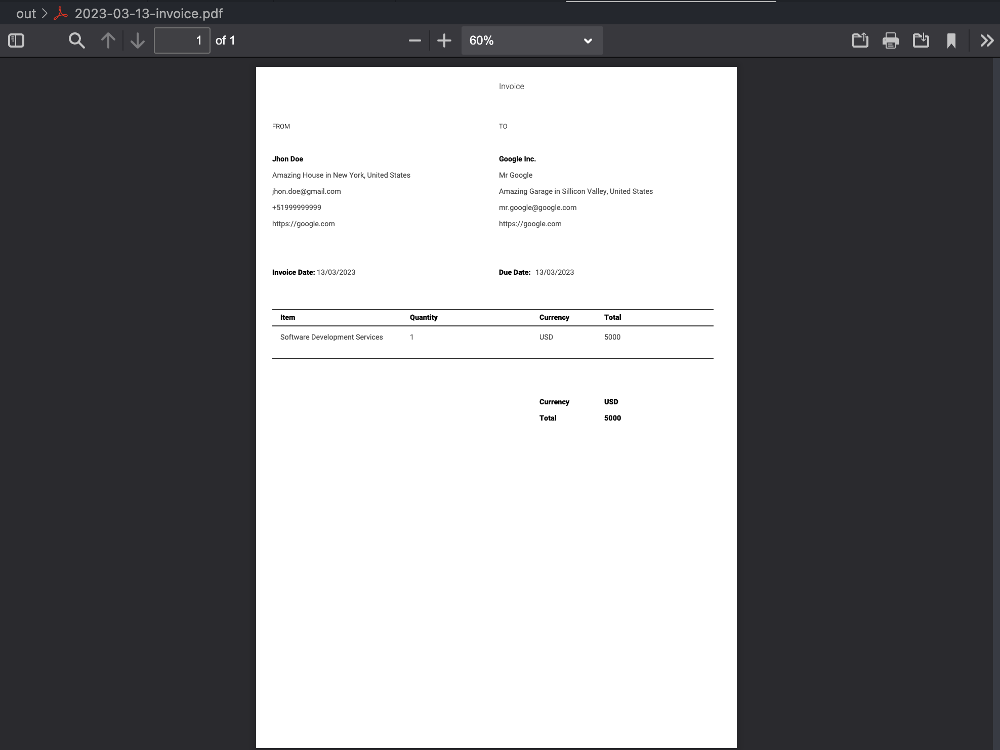

# Payment Invoice Generator

This is a simple invoice generator for payments. It is written in Go and uses the [Golang PDF library](github.com/signintech/gopdf). It is designed to be used as a command line tool and be combinaded with a CRON job it will also upload invoices to Google Drive in future.

## Usage

After set yout config file you can run the program with:

```bash
go run main.go
```

## Example




